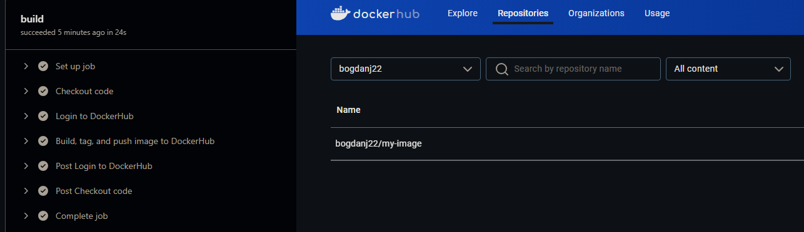

CI/CD Pipeline Project

Project Overview:

The primary goal of this project is to automate the process of building, testing, and deploying a Docker container image, using GitHub Actions for CI/CD. The pipeline integrates the following components:

Docker: Used to containerize the application, enabling consistent environments across development, testing, and production.

Flask: A lightweight Python web framework used for building the web application.

pytest: A Python testing framework that ensures the correctness of the application through automated tests.

DockerHub: Docker images are built and pushed to DockerHub, allowing easy deployment across environments.

